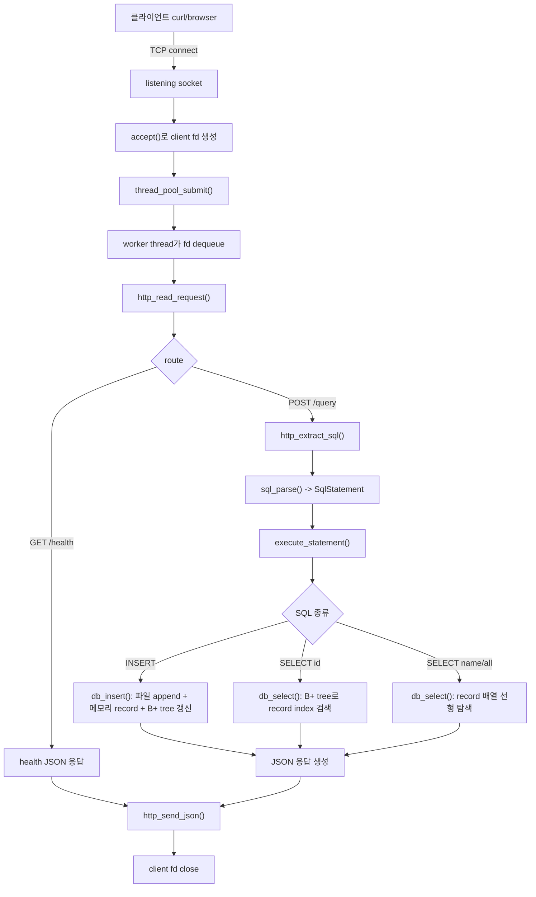

# WEEK8 미니 DBMS API 서버

C로 구현한 작은 파일 기반 DBMS API 서버입니다. BSD socket으로 HTTP 요청을 받고, JSON body 안의 SQL을 파싱한 뒤, 파일 저장소와 메모리 record 배열, B+ 트리 인덱스를 함께 사용해 `users` 테이블을 조회하거나 삽입합니다.

이 프로젝트는 production용 DB나 HTTP 서버가 아니라, TCP, file descriptor, HTTP framing, thread pool, SQL parser, file-backed storage, B+ tree index가 한 요청 안에서 어떻게 연결되는지 보기 위한 학습용 구현입니다.

## 실행 흐름 다이어그램



## 이전 SQL 처리기 + B+ 트리 이후 달라진 점

이전 단계가 “SQL 문자열을 구조체로 바꾸고, `id -> record index`를 B+ 트리로 찾을 수 있다”까지였다면, 현재 코드는 그 위에 실제 서버 실행 흐름을 얹었습니다.

| 추가된 지점 | 달라진 점 |
| --- | --- |
| HTTP API 계층 | `GET /health`, `POST /query`로 외부 클라이언트가 SQL을 보낼 수 있습니다. |
| TCP/socket 실행 루프 | `socket() -> bind() -> listen() -> accept()` 흐름으로 실제 client fd를 받습니다. |
| thread pool | main thread는 연결을 받고, worker thread가 요청 처리와 DB 실행을 맡습니다. |
| JSON 요청/응답 | 요청 body에서 `"sql"` 값을 추출하고, 결과를 JSON으로 직렬화합니다. |
| 파일 기반 저장 | `INSERT`가 `data/users.csv`에 append되고, 재시작 시 파일에서 record와 index를 복구합니다. |
| 동시성 제어 | DB engine이 `pthread_rwlock_t`로 SELECT는 read lock, INSERT는 write lock을 사용합니다. |
| 성능 관찰 값 | 응답과 로그에 `index_used`, `elapsed_us`가 포함되어 index 조회와 선형 탐색을 비교할 수 있습니다. |
| 벤치마크 스크립트 | `scripts/benchmark.sh`로 indexed lookup과 linear scan을 비교할 수 있습니다. |
| 코드 리팩터링 | JSON 문자열 생성 로직을 `util` 공통 `JsonBuilder`로 정리해 DB 결과와 서버 응답이 같은 경로를 사용합니다. |
| 문서 정리 | 중복 학습 문서를 `lessons/00_top_down_analysis_koh.md`로 흡수하고 README를 한국어로 정리했습니다. |

## 빌드

```sh
make
```

## 실행

```sh
./bin/week8_dbms
```

선택 인자:

```sh
./bin/week8_dbms [port] [thread_count] [data_file]
```

예시:

```sh
./bin/week8_dbms 8080 4 data/users.csv
```

## API 테스트

서버 상태 확인:

```sh
curl http://127.0.0.1:8080/health
```

row 삽입:

```sh
curl -s -X POST http://127.0.0.1:8080/query \
  -H 'Content-Type: application/json' \
  --data '{"sql":"INSERT INTO users name age VALUES '\''kim'\'' 20;"}'
```

전체 조회:

```sh
curl -s -X POST http://127.0.0.1:8080/query \
  -H 'Content-Type: application/json' \
  --data '{"sql":"SELECT * FROM users;"}'
```

인덱스 조회:

```sh
curl -s -X POST http://127.0.0.1:8080/query \
  -H 'Content-Type: application/json' \
  --data '{"sql":"SELECT * FROM users WHERE id = 1;"}'
```

선형 탐색 조회:

```sh
curl -s -X POST http://127.0.0.1:8080/query \
  -H 'Content-Type: application/json' \
  --data '{"sql":"SELECT * FROM users WHERE name = '\''kim'\'';"}'
```

## 테스트

```sh
make test
```

테스트 범위:

- 지원 SQL 파싱
- 지원하지 않는 SQL 거부
- B+ 트리 삽입과 검색
- 파일 기반 DB의 insert/select/reload 동작
- JSON body에서 SQL 추출

## 벤치마크

서버를 먼저 실행한 뒤 다음 명령을 실행합니다.

```sh
bash scripts/benchmark.sh 8080 1000
```

이 스크립트는 샘플 사용자를 삽입하고, 동시 요청을 보낸 뒤 `WHERE id` 인덱스 조회와 `WHERE name` 선형 탐색을 비교합니다.

## 지원 SQL

```sql
INSERT INTO users name age VALUES 'kim' 20;
SELECT * FROM users;
SELECT * FROM users WHERE id = 1;
SELECT * FROM users WHERE name = 'kim';
```

## 폴더 구조

```text
include/          공개 헤더
src/              구현 코드
tests/            C 테스트
scripts/          벤치마크와 데모 보조 스크립트
data/             CSV 데이터 파일
lessons/          한국어 학습 문서
```

## 읽기 순서

1. [lessons/00_top_down_analysis_koh.md](lessons/00_top_down_analysis_koh.md)
2. [lessons/README.md](lessons/README.md)
3. [lessons/03_code_reading/README.md](lessons/03_code_reading/README.md)
4. [design.md](design.md)
5. [requirements.md](requirements.md)
