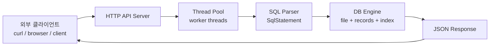
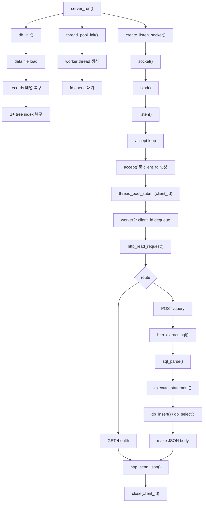
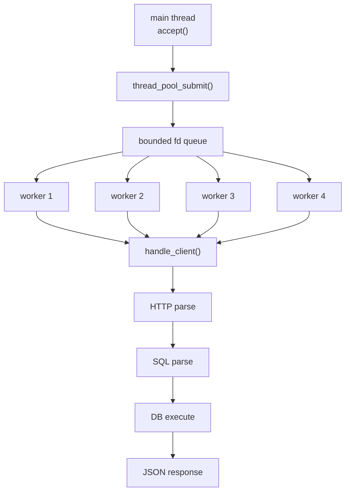
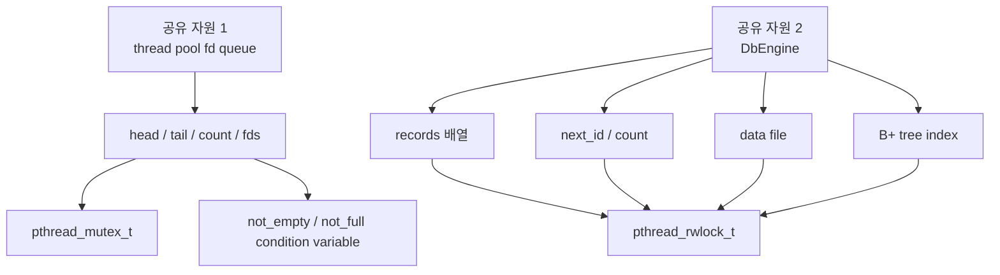
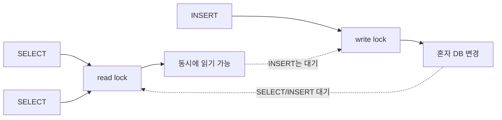
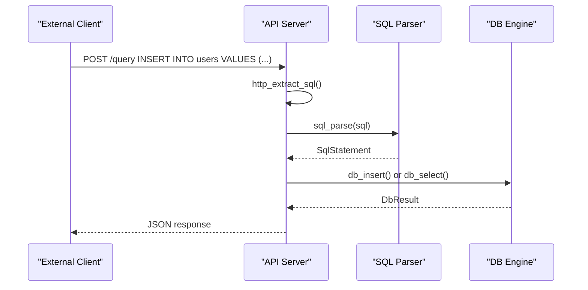

# WEEK8 미니 DBMS API 서버

C로 구현한 파일 기반 미니 DBMS를 HTTP 요청으로 다룰 수 있는 서버 프로젝트입니다. 
외부 클라이언트는 `curl` 같은 HTTP 클라이언트로 SQL을 보내고, 서버는 SQL 처리기와 내부 DB engine을 호출해 `users` 테이블에 `INSERT` 또는 `SELECT`를 수행합니다.

프로젝트의 핵심은 **외부 API 서버**, **thread pool 기반 병렬 요청 처리**, **멀티 스레드 동시성 제어**, **내부 DB engine 연결**입니다.

## 핵심 요약

```text
1. 외부 클라이언트가 HTTP API로 DBMS 기능을 사용한다.
2. main thread는 accept만 담당하고, worker thread들이 SQL 요청을 처리한다.
3. 여러 worker thread가 같은 DB engine을 공유하므로 lock으로 동시성 문제를 제어한다.
4. 이전 차수의 SQL 처리기와 B+ tree index는 내부 DB engine 구성 요소로 재사용한다.
```



## 구현 범위

| 요구사항 | 이 프로젝트에서 보여주는 지점 |
| --- | --- |
| API를 통해 외부 클라이언트에서 DBMS 기능 사용 | `GET /health`, `POST /query`를 HTTP로 호출 |
| Thread Pool 구성 및 SQL 요청 병렬 처리 | `thread_pool.c`의 고정 worker pool과 fd queue |
| 이전 SQL 처리기와 B+ tree index 활용 | `sql_parse()`와 `DbEngine.index`를 서버 요청 흐름에 연결 |
| 멀티 스레드 동시성 이슈 처리 | queue는 mutex/condition variable, DB는 read-write lock |
| 내부 DB 엔진과 외부 API 서버 연결 설계 | HTTP body의 SQL -> `SqlStatement` -> `DbResult` -> JSON |
| API 서버 아키텍처 | socket accept loop, routing, worker dispatch, JSON response |

## 실행 흐름



동작 방식 요약:

```text
main thread는 새 연결을 받는 역할에 집중합니다.
client_fd는 thread pool queue로 들어가고, worker thread가 HTTP 요청 처리, SQL 파싱, DB 실행, 응답 전송까지 담당합니다.
```

## Thread Pool 구조



thread pool이 해결하는 문제:

```text
요청이 들어올 때마다 새 thread를 계속 만들지 않고 고정 worker를 재사용한다.
worker thread들이 queue에서 client_fd를 꺼내 처리한다.
main thread가 긴 요청 처리 때문에 accept를 못 하는 상황을 줄인다.
```

## 동시성 제어

이 프로젝트에는 공유 자원이 두 종류 있습니다.



queue 동시성:

```text
main thread는 client_fd를 queue에 넣고,
worker thread들은 queue에서 client_fd를 꺼냅니다.

head, tail, count를 여러 thread가 동시에 바꾸면 queue가 깨질 수 있으므로 mutex로 보호합니다.
queue가 비어 있으면 worker는 not_empty에서 기다리고,
queue가 가득 차면 submit 쪽은 not_full에서 기다립니다.
```

DB 동시성:

```text
SELECT는 read lock을 잡습니다.
여러 SELECT는 동시에 실행될 수 있습니다.

INSERT는 write lock을 잡습니다.
INSERT는 파일 append, records 배열 추가, next_id 증가, B+ tree 갱신을 함께 수행하므로 혼자 실행되어야 합니다.
```



## API와 DB Engine 연결



설계 포인트:

```text
API 서버는 HTTP와 routing을 담당합니다.
SQL parser는 문자열 검증과 구조화를 담당합니다.
DB engine은 파일, 메모리 records, B+ tree index, lock을 담당합니다.

DB engine은 HTTP request나 raw body/JSON body 형식을 모릅니다.
이 덕분에 API 계층과 DB 계층의 책임이 분리됩니다.
```

## 주요 모듈

| 파일 | 책임 |
| --- | --- |
| `src/main.c` | CLI 인자를 읽고 `ServerConfig` 생성 |
| `src/server.c` | socket 생성, accept loop, routing, request logging |
| `src/thread_pool.c` | worker thread pool과 bounded fd queue |
| `src/http.c` | HTTP request 읽기, raw SQL body 또는 JSON body에서 SQL 추출, JSON response 전송 |
| `src/sql.c` | `INSERT INTO users VALUES (...)`, `SELECT 컬럼 FROM users` 같은 지원 SQL을 `SqlStatement`로 파싱 |
| `src/db.c` | file-backed users table, records 배열, lock, DB 실행 |
| `src/bptree.c` | `id -> record index` B+ tree index |
| `src/util.c` | JSON builder, escaping, 시간 측정 |

## 지원 API

### `GET /health`

서버 상태 확인용 API입니다.

```sh
curl http://127.0.0.1:8080/health
```

예상 응답:

```json
{"status":"ok"}
```

### `POST /query`

SQL 실행 API입니다.

```sh
curl -s -X POST http://127.0.0.1:8080/query \
  -H 'Content-Type: text/plain' \
  --data "INSERT INTO users VALUES (1, 'kim', 20);"
```

성공 응답 예시:

```json
{"ok":true,"rows":[{"id":1,"name":"kim","age":20}],"message":"inserted 1 row","index_used":false,"elapsed_us":100}
```

실패 응답 예시:

```json
{"ok":false,"error":"only INSERT and SELECT are supported"}
```

## 지원 SQL

```sql
INSERT INTO users VALUES (1, 'bumsang', 25);
INSERT INTO users name age VALUES 'kim' 20;
SELECT * FROM users;
SELECT id, name FROM users;
SELECT * FROM users WHERE id = 1;
SELECT * FROM users WHERE name = 'kim';
SELECT id, name FROM users WHERE name = 'kim';
```

기본 사용 방식은 HTTP body에 raw SQL을 전달하는 방식입니다


## 빌드와 실행

빌드:

```sh
make
```

테스트:

```sh
make test
```

서버 실행:

```sh
./bin/week8_dbms
```

선택 인자:

```sh
./bin/week8_dbms [port] [thread_count] [data_file]
```

예시 실행:

```sh
./bin/week8_dbms 8080 4 data/users.csv
```

## 테스트 범위

`make test`는 다음을 검증합니다.

```text
SQL parser
지원하지 않는 SQL 거부
B+ tree 삽입과 검색
DB insert/select/reload
raw SQL body와 JSON body에서 SQL 추출
SELECT 컬럼 projection
```

추가하면 좋은 테스트:

```text
동시 INSERT stress test
서버 통합 테스트
잘못된 HTTP request 테스트
파일 append 실패 시나리오
```

## 폴더 구조

```text
include/          공개 헤더
src/              구현 코드
tests/            C 테스트
scripts/          보조 스크립트
data/             CSV 데이터 파일
lessons/          한국어 학습 문서
```

## 회고

### 김다애


### 유승이


### 조현호


### 고유진
