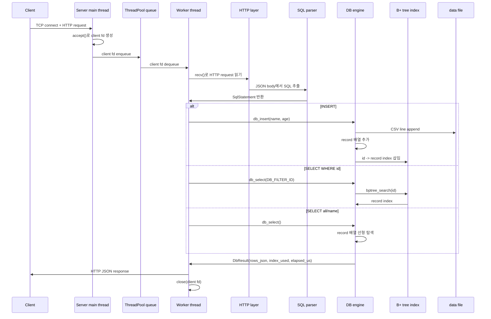

# 00. Top-Down 코드 분석_koh

이 문서는 프로젝트를 “파일 순서”가 아니라 “요청 하나가 지나가는 방향”으로 읽기 위한 탑다운 분석 문서입니다. `_koh`는 이번 정리에서 새로 추가한 학습 문서라는 표시입니다.

## 한 문장 요약

클라이언트가 HTTP로 SQL을 보내면, 서버는 client fd를 worker thread에 넘기고, worker는 HTTP body에서 SQL을 꺼내 `SqlStatement`로 바꾼 뒤 DB engine에서 파일, 메모리 배열, B+ tree를 사용해 결과 JSON을 만듭니다.

## 전체 동작 다이어그램



## 1단계: 바깥에서 보기

처음에는 함수 내부를 보지 말고 계층만 잡습니다.

| 계층 | 담당 파일 | 핵심 질문 |
| --- | --- | --- |
| 프로그램 시작 | `src/main.c` | port, thread 수, data file 경로를 어떻게 정하는가? |
| TCP 서버 | `src/server.c` | listening fd와 client fd는 어디서 만들어지는가? |
| 동시성 | `src/thread_pool.c` | client fd가 main thread에서 worker thread로 어떻게 넘어가는가? |
| HTTP | `src/http.c` | byte stream에서 method, path, body를 어떻게 나누는가? |
| SQL | `src/sql.c` | SQL 문자열을 왜 바로 실행하지 않고 구조체로 바꾸는가? |
| DB | `src/db.c` | 파일, 메모리 record 배열, lock, index가 어떤 순서로 움직이는가? |
| 인덱스 | `src/bptree.c` | `WHERE id = ?`가 왜 선형 탐색보다 빠른가? |

## 2단계: 요청 하나 따라가기

`curl -X POST /query` 요청 하나를 기준으로 읽습니다.

1. `server_run()`이 listening socket을 만들고 `accept()`로 client fd를 받습니다.
2. `thread_pool_submit()`이 client fd를 bounded queue에 넣습니다.
3. worker thread가 queue에서 fd를 꺼내 `handle_client()`를 실행합니다.
4. `http_read_request()`가 HTTP header와 body를 읽습니다.
5. `/query` route이면 `http_extract_sql()`이 JSON body에서 SQL 문자열을 꺼냅니다.
6. `sql_parse()`가 SQL 문자열을 `SqlStatement`로 변환합니다.
7. `execute_statement()`가 `SqlStatement`를 DB 호출로 바꿉니다.
8. `db_insert()` 또는 `db_select()`가 실제 데이터를 다룹니다.
9. `make_success_body()`가 `DbResult`를 HTTP 응답 JSON으로 직렬화합니다.
10. `http_send_json()`이 socket fd에 응답을 쓰고 연결을 닫습니다.

## 3단계: SQL 처리기 + B+ 트리 이후 추가된 것

이전 구현을 “SQL parser와 B+ tree index가 있다”로 보면, 이번 상태에서 추가된 핵심은 실행 환경입니다.

| 기준선 | 추가 후 |
| --- | --- |
| SQL 문자열을 `SqlStatement`로 바꿀 수 있음 | HTTP JSON body에서 SQL을 꺼내 외부 요청으로 실행할 수 있음 |
| B+ tree가 `id -> value`를 검색할 수 있음 | DB engine이 `id -> record index`로 사용하며 실제 `SELECT WHERE id`에 연결됨 |
| parser와 index가 각각 독립 동작 | server, HTTP, SQL, DB, index가 한 요청 흐름으로 연결됨 |
| 메모리 구조 중심 | CSV 파일에 append하고 재시작 시 다시 로드함 |
| 단일 호출 중심 | thread pool로 여러 client 요청을 동시에 처리함 |
| 성능 차이를 코드로만 추론 | 응답의 `index_used`, `elapsed_us`와 benchmark로 차이를 관찰함 |
| JSON 문자열 생성이 파일별로 흩어질 수 있음 | `JsonBuilder`를 `util`로 분리해 DB와 server가 공통 유틸을 사용함 |

## 4단계: lock 관점으로 다시 보기

DB engine은 하나의 `pthread_rwlock_t`를 사용합니다.

```text
SELECT
  -> read lock
  -> 여러 SELECT가 동시에 들어올 수 있음

INSERT
  -> write lock
  -> 파일 append, record 배열 추가, B+ tree 갱신을 한 흐름으로 보호
```

이 구조는 table-level lock보다 단순하지만, 학습용으로는 “읽기는 같이, 쓰기는 단독”이라는 핵심을 보기 좋습니다.

## 5단계: index 사용 여부 확인하기

인덱스를 쓰는 요청:

```sql
SELECT * FROM users WHERE id = 1;
```

응답에는 다음처럼 나옵니다.

```json
{"index_used":true}
```

인덱스를 쓰지 않는 요청:

```sql
SELECT * FROM users WHERE name = 'kim';
```

응답에는 다음처럼 나옵니다.

```json
{"index_used":false}
```

이 차이가 이 프로젝트의 가장 중요한 관찰 포인트입니다. 같은 `SELECT`라도 `id` 조건은 B+ tree를 거치고, `name` 조건은 record 배열을 처음부터 끝까지 훑습니다.

## 다음에 읽을 문서

- [README.md](README.md): lessons 폴더 전체 지도
- [03_code_reading/README.md](03_code_reading/README.md): 실제 코드 독해 순서
- [../README.md](../README.md): 실행법과 API 사용법
