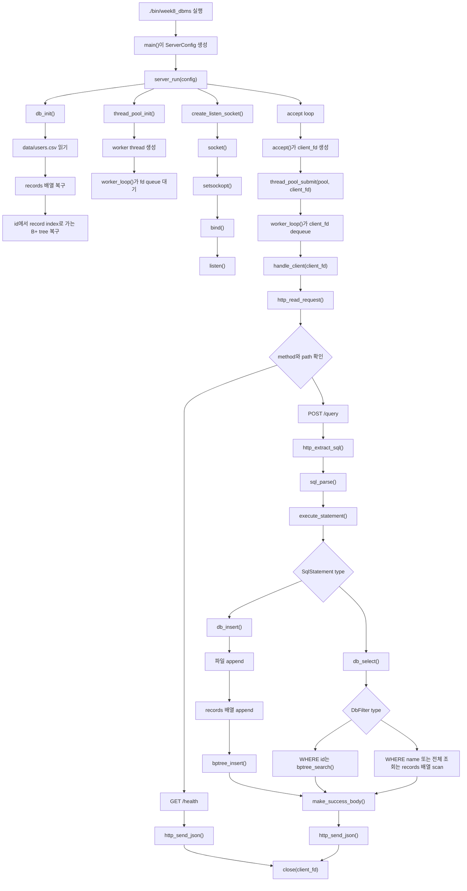

# WEEK8 미니 DBMS API 서버를 탑다운으로 읽기

이 문서는 `src/`와 `include/`의 코드를 소스 파일 순서대로 무작정 해설하지 않습니다.

먼저 이 프로그램의 목표를 정합니다.

```text
HTTP 요청으로 들어온 SQL 문자열을 읽는다.
지원하는 SQL만 구조체로 바꾼다.
파일 기반 users 테이블과 B+ 트리 인덱스를 사용해 INSERT/SELECT를 실행한다.
결과를 JSON HTTP 응답으로 돌려준다.
```

그 목표를 이루려면 서버가 실행 중에 해결해야 하는 문제들이 있습니다.

```text
1. 실행 옵션을 읽고 서버 설정을 만든다.
2. 데이터 파일을 열어 메모리 record 배열과 B+ 트리 인덱스를 복구한다.
3. worker thread와 fd queue를 준비한다.
4. listening socket을 열고 TCP 연결을 기다린다.
5. accept()로 얻은 client fd를 worker에게 넘긴다.
6. worker가 HTTP request의 경계를 찾아 method, path, body를 만든다.
7. route에 따라 health 응답을 보내거나 SQL query를 처리한다.
8. JSON body에서 sql 문자열을 꺼낸다.
9. SQL 문자열을 SqlStatement 구조체로 바꾼다.
10. SqlStatement를 DbFilter 또는 INSERT 작업으로 바꿔 DB engine을 호출한다.
11. DB engine이 파일, 메모리 배열, B+ 트리, lock을 함께 사용한다.
12. DbResult를 JSON body로 직렬화하고 HTTP response를 보낸다.
13. 요청 처리가 끝난 client fd를 닫고, 종료 신호가 오면 자원을 해제한다.
```

함수는 이 문제들을 해결하기 위해 등장합니다. 그래서 이 문서는 함수가 나오는 자리마다 아래 네 가지를 같이 봅니다.

```text
필요한 헤더
함수 원형
파라미터
반환값
```

## 전체 지도



가장 중요한 구분은 이것입니다.

```text
listen_fd
  서버가 문을 열어 놓고 새 연결을 기다리는 fd입니다.
  accept loop가 소유합니다.

client_fd
  특정 클라이언트와 실제로 읽고 쓰는 fd입니다.
  accept()가 만들고 worker thread가 처리한 뒤 close()합니다.

SQL text
  HTTP body 안에 들어 있던 문자열입니다.
  아직 실행 가능한 명령이 아닙니다.

SqlStatement
  parser가 지원 문법만 확인한 뒤 만든 작은 실행 계획입니다.
  DB engine은 이 구조체를 보고 INSERT인지 SELECT인지 결정합니다.

Record 배열
  실제 row를 메모리에 들고 있는 저장소입니다.

B+ tree
  row 전체를 들고 있지 않습니다.
  id를 record 배열의 위치로 바꿔 주는 인덱스입니다.
```

## 1. 실행 설정을 만든다

해결하려는 문제:

```text
서버는 기본값으로도 실행되어야 하고, 필요하면 포트, worker 수, 데이터 파일 경로를 명령행에서 바꿀 수 있어야 합니다.
```

사용 코드:

```c
config.port = 8080;
config.thread_count = 4;
config.data_path = "data/users.csv";

if (argc > 1) {
    config.port = parse_int_arg(argv[1], config.port);
}

if (argc > 2) {
    int threads = parse_int_arg(argv[2], (int)config.thread_count);
    config.thread_count = (size_t)threads;
}

if (argc > 3) {
    config.data_path = argv[3];
}

return server_run(&config);
```

`main()`은 서버의 실제 일을 하지 않습니다. 실행 옵션을 `ServerConfig`에 모으고 `server_run()`으로 넘깁니다.

### `strtol`

해결하려는 문제:

```text
argv는 문자열입니다. port와 thread_count로 쓰려면 정수로 바꿔야 합니다.
```

사용 코드:

```c
long value = strtol(text, &end, 10);

if (end == text || *end != '\0' || value <= 0 || value > 65535) {
    return fallback;
}
```

API 카드:

```c
#include <stdlib.h>

long strtol(const char *nptr, char **endptr, int base);
```

```text
nptr
  정수로 해석할 문자열입니다.

endptr
  변환이 멈춘 위치를 돌려받습니다.
  이 프로그램은 전체 문자열이 숫자였는지 확인하려고 사용합니다.

base
  10진수로 읽기 위해 10을 넘깁니다.

반환값
  변환된 long 값입니다.
  이 서버는 값이 0 이하이거나 65535보다 크면 기본값을 사용합니다.
```

## 2. 종료 신호를 받을 준비를 한다

해결하려는 문제:

```text
서버는 계속 accept loop를 돕니다.
Ctrl+C나 종료 신호가 왔을 때 loop를 빠져나가 자원을 해제해야 합니다.
```

사용 코드:

```c
static volatile sig_atomic_t g_should_stop = 0;

static void handle_signal(int signo)
{
    (void)signo;
    g_should_stop = 1;
}

signal(SIGPIPE, SIG_IGN);
sigaction(SIGINT, &action, NULL);
sigaction(SIGTERM, &action, NULL);
```

`SIGPIPE`는 무시합니다. 클라이언트가 먼저 연결을 끊은 뒤 서버가 쓰기를 시도할 수 있기 때문입니다. `SIGINT`, `SIGTERM`은 `g_should_stop`을 바꿔 accept loop가 멈출 수 있게 합니다.

### `sigaction`

해결하려는 문제:

```text
특정 signal이 왔을 때 실행할 handler를 등록합니다.
```

API 카드:

```c
#include <signal.h>

int sigaction(int signum, const struct sigaction *act, struct sigaction *oldact);
```

```text
signum
  이 프로그램에서는 SIGINT, SIGTERM입니다.

act
  새 handler 설정입니다.
  action.sa_handler에 handle_signal을 넣습니다.

oldact
  이전 설정을 받을 포인터입니다.
  이 프로그램은 필요 없어서 NULL을 넘깁니다.

반환값
  성공하면 0, 실패하면 -1입니다.
  이 코드는 signal 설정 실패를 별도로 복구하지 않습니다.
```

## 3. DB 상태를 복구한다

해결하려는 문제:

```text
서버가 재시작되어도 기존 users 데이터는 사라지면 안 됩니다.
그래서 시작할 때 data/users.csv를 읽고 메모리 상태를 다시 만듭니다.
```

사용 코드:

```c
file = fopen(db->data_path, "a+");

rewind(file);
while (fgets(line, sizeof(line), file) != NULL) {
    Record record;
    char name[DB_NAME_MAX];

    if (sscanf(line, "%d,%127[^,],%d", &record.id, name, &record.age) != 3) {
        fclose(file);
        db_destroy(db);
        set_err(err, err_size, "malformed data file");
        return 0;
    }

    snprintf(record.name, sizeof(record.name), "%s", name);
    if (!load_record(db, &record)) {
        fclose(file);
        db_destroy(db);
        set_err(err, err_size, "failed to load data file into memory");
        return 0;
    }
}
```

`DbEngine`이 들고 있는 상태는 네 가지입니다.

```text
data_path
  append할 파일 경로입니다.

records, count, capacity
  현재 row들을 담는 동적 배열입니다.

next_id
  다음 INSERT에 부여할 auto-increment id입니다.

index
  id -> records 배열 위치를 찾는 B+ tree입니다.

lock
  SELECT와 INSERT가 동시에 들어올 때 DB 상태를 보호합니다.
```

### `pthread_rwlock_init`

해결하려는 문제:

```text
여러 worker thread가 같은 DbEngine을 만집니다.
SELECT끼리는 같이 읽을 수 있지만, INSERT는 파일과 메모리와 인덱스를 한 번에 바꾸므로 배타적으로 실행되어야 합니다.
```

사용 코드:

```c
if (pthread_rwlock_init(&db->lock, NULL) != 0) {
    set_err(err, err_size, "failed to initialize DB lock");
    return 0;
}
```

API 카드:

```c
#include <pthread.h>

int pthread_rwlock_init(pthread_rwlock_t *rwlock, const pthread_rwlockattr_t *attr);
```

```text
rwlock
  초기화할 read-write lock입니다.

attr
  기본 속성을 쓰기 위해 NULL을 넘깁니다.

반환값
  성공하면 0입니다.
  실패하면 DB init 전체를 실패시킵니다.
```

### `fopen`

해결하려는 문제:

```text
데이터 파일이 없으면 만들고, 있으면 읽을 수 있어야 합니다.
```

사용 코드:

```c
file = fopen(db->data_path, "a+");
```

API 카드:

```c
#include <stdio.h>

FILE *fopen(const char *pathname, const char *mode);
```

```text
pathname
  data/users.csv 같은 파일 경로입니다.

mode
  "a+"는 읽기와 append를 함께 허용합니다.
  파일이 없으면 새로 만듭니다.

반환값
  성공하면 FILE*, 실패하면 NULL입니다.
  이 서버는 NULL이면 DB init을 실패시킵니다.
```

### `fgets`

해결하려는 문제:

```text
CSV-like 파일을 한 줄씩 읽어 Record로 복구해야 합니다.
```

API 카드:

```c
#include <stdio.h>

char *fgets(char *s, int size, FILE *stream);
```

```text
s
  한 줄을 받을 버퍼입니다.

size
  버퍼 크기입니다. 이 프로그램은 line[512]를 넘깁니다.

stream
  fopen으로 연 데이터 파일입니다.

반환값
  성공하면 s, EOF나 오류면 NULL입니다.
```

### `sscanf`

해결하려는 문제:

```text
"1,kim,20" 형태의 한 줄을 id, name, age로 나눕니다.
```

사용 코드:

```c
sscanf(line, "%d,%127[^,],%d", &record.id, name, &record.age)
```

API 카드:

```c
#include <stdio.h>

int sscanf(const char *str, const char *format, ...);
```

```text
str
  파일에서 읽은 한 줄입니다.

format
  %d는 정수, %127[^,]는 쉼표 전까지 최대 127글자의 이름을 읽습니다.

반환값
  성공적으로 채운 항목 수입니다.
  이 서버는 3이 아니면 데이터 파일이 망가졌다고 봅니다.
```

## 4. worker thread와 fd queue를 준비한다

해결하려는 문제:

```text
main thread가 요청 처리까지 직접 하면 새 연결을 받지 못하고 막힐 수 있습니다.
그래서 main thread는 accept에 집중하고, worker thread가 client fd를 처리합니다.
```

사용 코드:

```c
if (!thread_pool_init(&pool, config->thread_count, REQUEST_QUEUE_CAPACITY, handle_client, &context)) {
    fprintf(stderr, "Thread pool init failed\n");
    db_destroy(&context.db);
    return 1;
}
```

`ThreadPool`은 fd만 저장합니다. HTTP request나 SQL 문자열을 queue에 넣지 않습니다.

```text
main thread
  accept()로 client_fd를 얻음
  thread_pool_submit(pool, client_fd)

worker thread
  queue에서 client_fd를 꺼냄
  handle_client(client_fd, context)
```

### `pthread_create`

해결하려는 문제:

```text
worker_loop를 실행할 thread_count개의 worker thread를 만듭니다.
```

사용 코드:

```c
pthread_create(&pool->threads[i], NULL, worker_loop, pool)
```

API 카드:

```c
#include <pthread.h>

int pthread_create(pthread_t *thread, const pthread_attr_t *attr,
                   void *(*start_routine)(void *), void *arg);
```

```text
thread
  생성된 thread id를 저장할 위치입니다.

attr
  기본 thread 속성을 쓰기 위해 NULL입니다.

start_routine
  새 thread가 실행할 함수입니다. 여기서는 worker_loop입니다.

arg
  worker_loop에 넘길 값입니다. 여기서는 ThreadPool*입니다.

반환값
  성공하면 0입니다.
  실패하면 thread_pool_init은 실패합니다.
```

### `pthread_mutex_lock`, `pthread_cond_wait`

해결하려는 문제:

```text
fd queue는 여러 thread가 함께 접근합니다.
queue가 비었을 때 worker는 바쁘게 돌지 말고 잠들어야 합니다.
queue가 가득 찼을 때 submit 쪽도 자리가 날 때까지 기다려야 합니다.
```

사용 코드:

```c
pthread_mutex_lock(&pool->mutex);
while (!pool->stopping && pool->count == 0) {
    pthread_cond_wait(&pool->not_empty, &pool->mutex);
}
client_fd = pool->fds[pool->head];
pool->head = (pool->head + 1) % pool->capacity;
pool->count--;
pthread_cond_signal(&pool->not_full);
pthread_mutex_unlock(&pool->mutex);
```

API 카드:

```c
#include <pthread.h>

int pthread_mutex_lock(pthread_mutex_t *mutex);
int pthread_mutex_unlock(pthread_mutex_t *mutex);
int pthread_cond_wait(pthread_cond_t *cond, pthread_mutex_t *mutex);
int pthread_cond_signal(pthread_cond_t *cond);
```

```text
mutex
  queue의 head, tail, count를 보호합니다.

cond
  not_empty는 worker에게 새 fd가 왔음을 알립니다.
  not_full은 submit 쪽에 queue 자리가 생겼음을 알립니다.

반환값
  성공하면 0입니다.
  이 프로젝트의 thread-pool 코드는 초기화 뒤 일반 lock/unlock 실패를 별도로 복구하지 않습니다.
```

중요한 점:

```text
pthread_cond_wait는 기다리는 동안 mutex를 풀고,
깨어나면 다시 mutex를 잡은 상태로 돌아옵니다.
그래서 while 조건으로 queue 상태를 다시 확인합니다.
```

## 5. TCP 연결을 받을 문을 연다

해결하려는 문제:

```text
서버는 127.0.0.1:8080 같은 주소에서 TCP 연결을 기다려야 합니다.
```

사용 코드:

```c
listen_fd = socket(AF_INET, SOCK_STREAM, 0);
setsockopt(listen_fd, SOL_SOCKET, SO_REUSEADDR, &opt, sizeof(opt));

memset(&addr, 0, sizeof(addr));
addr.sin_family = AF_INET;
addr.sin_addr.s_addr = htonl(INADDR_ANY);
addr.sin_port = htons((uint16_t)port);

bind(listen_fd, (struct sockaddr *)&addr, sizeof(addr));
listen(listen_fd, SOMAXCONN);
```

### `socket`

해결하려는 문제:

```text
운영체제에 TCP 통신 endpoint를 하나 만들어 달라고 요청합니다.
```

API 카드:

```c
#include <sys/socket.h>

int socket(int domain, int type, int protocol);
```

```text
domain
  AF_INET은 IPv4 주소 체계를 뜻합니다.

type
  SOCK_STREAM은 TCP처럼 연결 기반 byte stream을 뜻합니다.

protocol
  0은 domain/type 조합에 맞는 기본 프로토콜을 사용하겠다는 뜻입니다.

반환값
  성공하면 fd, 실패하면 -1입니다.
  이 fd는 아직 client와 통신하는 fd가 아니라 listening socket이 될 재료입니다.
```

### `setsockopt`

해결하려는 문제:

```text
서버를 껐다 켠 직후에도 같은 포트를 다시 bind하기 쉽게 만듭니다.
```

API 카드:

```c
#include <sys/socket.h>

int setsockopt(int socket, int level, int option_name,
               const void *option_value, socklen_t option_len);
```

```text
socket
  socket()으로 만든 listen_fd입니다.

level, option_name
  SOL_SOCKET, SO_REUSEADDR 조합을 사용합니다.

option_value
  int opt = 1의 주소입니다.

반환값
  성공하면 0, 실패하면 -1입니다.
  실패하면 listen_fd를 닫고 socket 생성 전체를 실패시킵니다.
```

### `bind`

해결하려는 문제:

```text
socket fd를 실제 IP 주소와 port에 묶습니다.
```

API 카드:

```c
#include <sys/socket.h>

int bind(int sockfd, const struct sockaddr *addr, socklen_t addrlen);
```

```text
sockfd
  listen_fd입니다.

addr
  sockaddr_in을 sockaddr*로 캐스팅해서 넘깁니다.

addrlen
  sizeof(addr)입니다.

반환값
  성공하면 0, 실패하면 -1입니다.
  포트가 이미 사용 중이면 여기서 실패할 수 있습니다.
```

### `listen`

해결하려는 문제:

```text
bind된 socket을 수동적인 listening socket으로 바꿉니다.
이제 이 fd는 연결을 직접 주고받는 fd가 아니라 새 연결을 기다리는 fd입니다.
```

API 카드:

```c
#include <sys/socket.h>

int listen(int sockfd, int backlog);
```

```text
sockfd
  bind까지 끝난 listen_fd입니다.

backlog
  커널이 대기시킬 연결 큐의 힌트입니다.
  이 프로젝트는 SOMAXCONN을 사용합니다.

반환값
  성공하면 0, 실패하면 -1입니다.
```

## 6. 새 연결을 accept하고 worker에게 넘긴다

해결하려는 문제:

```text
listen_fd는 문입니다.
client_fd는 들어온 손님과 대화하는 전용 통로입니다.
서버는 새 통로를 계속 만들고 worker에게 넘겨야 합니다.
```

사용 코드:

```c
while (!g_should_stop) {
    struct sockaddr_in client_addr;
    socklen_t client_len = sizeof(client_addr);
    int client_fd = accept(listen_fd, (struct sockaddr *)&client_addr, &client_len);

    if (client_fd < 0) {
        if (errno == EINTR) {
            continue;
        }
        perror("accept");
        continue;
    }

    if (!thread_pool_submit(&pool, client_fd)) {
        close(client_fd);
        break;
    }
}
```

### `accept`

해결하려는 문제:

```text
대기 중인 TCP 연결 하나를 꺼내 client fd를 만듭니다.
```

API 카드:

```c
#include <sys/socket.h>

int accept(int sockfd, struct sockaddr *addr, socklen_t *addrlen);
```

```text
sockfd
  listen_fd입니다.

addr
  연결한 client 주소를 받을 공간입니다.
  이 프로젝트는 주소를 로그에 쓰지는 않습니다.

addrlen
  addr 버퍼 크기를 넣고, 실제 크기를 돌려받습니다.

반환값
  성공하면 새 client fd, 실패하면 -1입니다.
  EINTR이면 signal 때문에 잠깐 깬 것이므로 다시 loop를 돕니다.
```

### `close`

해결하려는 문제:

```text
더 이상 쓰지 않는 fd를 운영체제에 반납합니다.
```

사용 코드:

```c
close(client_fd);
close(listen_fd);
```

API 카드:

```c
#include <unistd.h>

int close(int fd);
```

```text
fd
  닫을 file descriptor입니다.

반환값
  성공하면 0, 실패하면 -1입니다.
  이 서버는 요청 처리가 끝난 client_fd를 닫아 HTTP keep-alive를 의도적으로 지원하지 않습니다.
```

## 7. HTTP request 경계를 찾는다

해결하려는 문제:

```text
TCP는 byte stream입니다.
한 번 recv했다고 HTTP request 하나가 정확히 들어온다는 보장이 없습니다.
서버는 header 끝과 Content-Length를 사용해 body 끝을 계산해야 합니다.
```

사용 코드:

```c
while (headers_end == NULL && used < HTTP_MAX_REQUEST) {
    ssize_t n = recv(client_fd, buffer + used, HTTP_MAX_REQUEST - used, 0);
    used += (size_t)n;
    buffer[used] = '\0';
    headers_end = strstr(buffer, "\r\n\r\n");
}

sscanf(buffer, "%7s %127s", request->method, request->path);
parse_content_length(buffer, headers_end, &content_length);

while (used < total_needed) {
    ssize_t n = recv(client_fd, buffer + used, total_needed - used, 0);
    used += (size_t)n;
}
```

이 HTTP parser는 학습용 최소 구현입니다.

```text
지원하는 것
  method, path 읽기
  Content-Length 읽기
  body를 request->body에 복사하기

지원하지 않는 것
  chunked transfer
  keep-alive
  header 전체 모델링
  완전한 JSON parser
```

### `recv`

해결하려는 문제:

```text
client fd에서 들어온 TCP bytes를 읽습니다.
```

API 카드:

```c
#include <sys/socket.h>

ssize_t recv(int sockfd, void *buf, size_t len, int flags);
```

```text
sockfd
  accept()가 만든 client_fd입니다.

buf
  bytes를 받을 버퍼 위치입니다.

len
  이번에 최대 몇 byte를 받을지입니다.

flags
  이 프로젝트는 특별한 옵션이 없어서 0을 넘깁니다.

반환값
  양수면 읽은 byte 수입니다.
  0이면 client가 연결을 닫은 것입니다.
  -1이면 오류이며, errno가 EINTR이면 다시 시도합니다.
```

### `strstr`

해결하려는 문제:

```text
HTTP header와 body 사이의 빈 줄, 즉 "\r\n\r\n" 위치를 찾습니다.
```

API 카드:

```c
#include <string.h>

char *strstr(const char *haystack, const char *needle);
```

```text
haystack
  지금까지 recv한 request buffer입니다.

needle
  "\r\n\r\n"입니다.

반환값
  찾으면 그 위치의 포인터, 못 찾으면 NULL입니다.
```

### `strtoul`

해결하려는 문제:

```text
Content-Length header의 숫자 문자열을 size_t로 바꾸기 위해 사용합니다.
```

API 카드:

```c
#include <stdlib.h>

unsigned long strtoul(const char *nptr, char **endptr, int base);
```

```text
nptr
  Content-Length: 뒤의 문자열입니다.

endptr
  숫자를 하나도 읽지 못했는지 확인하려고 사용합니다.

base
  10진수입니다.

반환값
  변환된 unsigned long 값입니다.
```

## 8. route를 고르고 SQL 문자열을 꺼낸다

해결하려는 문제:

```text
모든 HTTP 요청이 SQL 실행은 아닙니다.
path와 method를 먼저 보고, POST /query일 때만 body에서 sql 값을 꺼냅니다.
```

사용 코드:

```c
if (strcasecmp(request.method, "GET") == 0 && strcmp(request.path, "/health") == 0) {
    http_send_json(client_fd, 200, "{\"status\":\"ok\"}");
} else if (strcasecmp(request.method, "POST") == 0 && strcmp(request.path, "/query") == 0) {
    handle_query(client_fd, server_context, &request);
} else if (strcmp(request.path, "/query") == 0 || strcmp(request.path, "/health") == 0) {
    send_error_response(client_fd, 405, "method not allowed");
} else {
    send_error_response(client_fd, 404, "route not found");
}
```

### `strcasecmp`

해결하려는 문제:

```text
HTTP method는 대소문자 차이 때문에 흔들리지 않게 비교합니다.
```

API 카드:

```c
#include <strings.h>

int strcasecmp(const char *s1, const char *s2);
```

```text
s1, s2
  비교할 문자열입니다.

반환값
  대소문자를 무시하고 같으면 0입니다.
```

### `http_extract_sql`

해결하려는 문제:

```text
요청 body에서 "sql" key의 문자열 값을 꺼냅니다.
```

사용 코드:

```c
if (!http_extract_sql(request->body, sql, sizeof(sql), err, sizeof(err))) {
    send_error_response(client_fd, 400, err);
    log_request(client_fd, request, "bad-json", 0, 0);
    return;
}
```

이 함수는 프로젝트 코드입니다. 완전한 JSON parser가 아니라 이 서버가 받는 요청 형태만 처리합니다.

```json
{"sql":"SELECT * FROM users WHERE id = 1;"}
```

지원하는 escape는 `"`, `\`, `/`, `\n`, `\r`, `\t`입니다. 그 밖의 escape가 나오면 400 응답을 보냅니다.

## 9. SQL text를 SqlStatement로 바꾼다

해결하려는 문제:

```text
DB engine은 SQL 문자열 전체를 이해하지 않습니다.
parser가 지원하는 문법만 확인하고, 실행에 필요한 정보만 SqlStatement에 담습니다.
```

사용 코드:

```c
if (!sql_parse(sql, &stmt, err, sizeof(err))) {
    send_error_response(client_fd, 400, err);
    log_request(client_fd, request, "bad-sql", 0, 0);
    return;
}
```

지원 SQL:

```sql
INSERT INTO users name age VALUES 'kim' 20;
SELECT * FROM users;
SELECT * FROM users WHERE id = 1;
SELECT * FROM users WHERE name = 'kim';
```

`SqlStatement`의 핵심 필드는 아래와 같습니다.

```text
type
  SQL_INSERT 또는 SQL_SELECT입니다.

insert_name, insert_age
  INSERT에서 새 record를 만들 값입니다.

where_type
  SELECT에서 필터 종류를 나타냅니다.
  SQL_WHERE_NONE, SQL_WHERE_ID, SQL_WHERE_NAME 중 하나입니다.

where_id, where_name
  WHERE id 또는 WHERE name의 값입니다.
```

### `read_word`

해결하려는 문제:

```text
INSERT, SELECT, users, name 같은 SQL 단어를 하나씩 읽습니다.
```

사용 코드:

```c
while (isalnum((unsigned char)*cur) || *cur == '_') {
    if (len + 1 >= out_size) {
        return 0;
    }
    out[len++] = *cur;
    cur++;
}
```

이 함수는 프로젝트 코드입니다. SQL token 전체를 다루는 범용 lexer가 아니라, 이 프로젝트가 지원하는 식별자 형태만 읽습니다.

### `strncasecmp`

해결하려는 문제:

```text
SQL 시작이 INSERT인지 SELECT인지 대소문자를 무시하고 빠르게 판단합니다.
```

사용 코드:

```c
if (strncasecmp(p, "INSERT", 6) == 0) {
    return parse_insert(p, stmt, err, err_size);
}

if (strncasecmp(p, "SELECT", 6) == 0) {
    return parse_select(p, stmt, err, err_size);
}
```

API 카드:

```c
#include <strings.h>

int strncasecmp(const char *s1, const char *s2, size_t n);
```

```text
s1, s2
  비교할 문자열입니다.

n
  앞에서 몇 글자만 비교할지입니다.

반환값
  대소문자를 무시하고 같으면 0입니다.
```

주의할 점:

```text
이 parser는 "INSERTED"처럼 INSERT로 시작하는 이상한 입력을 처음에는 parse_insert로 넘길 수 있습니다.
하지만 parse_insert 내부에서 expect_keyword가 전체 단어를 다시 읽으므로 최종적으로는 거부됩니다.
```

## 10. SqlStatement를 DB 작업으로 바꾼다

해결하려는 문제:

```text
server layer는 SQL parser와 DB engine 사이의 어댑터 역할을 합니다.
SqlStatement를 보고 db_insert 또는 db_select 호출로 바꿉니다.
```

사용 코드:

```c
static DbResult execute_statement(DbEngine *db, const SqlStatement *stmt)
{
    if (stmt->type == SQL_INSERT) {
        return db_insert(db, stmt->insert_name, stmt->insert_age);
    }

    DbFilter filter;
    memset(&filter, 0, sizeof(filter));

    if (stmt->where_type == SQL_WHERE_ID) {
        filter.type = DB_FILTER_ID;
        filter.id = stmt->where_id;
    } else if (stmt->where_type == SQL_WHERE_NAME) {
        filter.type = DB_FILTER_NAME;
        snprintf(filter.name, sizeof(filter.name), "%s", stmt->where_name);
    } else {
        filter.type = DB_FILTER_ALL;
    }

    return db_select(db, filter);
}
```

여기서 중요한 경계:

```text
SQL parser
  문자열 문법이 맞는지 확인합니다.

server adapter
  SqlStatement를 DbFilter 또는 INSERT 인자로 바꿉니다.

DB engine
  파일, record 배열, B+ tree, lock을 실제로 만집니다.
```

## 11. INSERT는 파일, 메모리, 인덱스를 함께 바꾼다

해결하려는 문제:

```text
INSERT는 새 row를 영구 저장소와 메모리 조회 구조에 모두 반영해야 합니다.
중간에 다른 thread가 읽으면 상태가 깨질 수 있으므로 write lock이 필요합니다.
```

사용 코드:

```c
if (pthread_rwlock_wrlock(&db->lock) != 0) {
    return make_error_result("failed to acquire write lock", start_us);
}

record.id = db->next_id;
snprintf(record.name, sizeof(record.name), "%s", name);
record.age = age;
record_index = db->count;

file = fopen(db->data_path, "a");
fprintf(file, "%d,%s,%d\n", record.id, record.name, record.age);
fclose(file);

db->records[record_index] = record;
db->count++;
db->next_id++;

bptree_insert(&db->index, record.id, record_index);
pthread_rwlock_unlock(&db->lock);
```

INSERT의 순서를 말로 쓰면 이렇습니다.

```text
1. write lock을 잡는다.
2. name과 age를 검증한다.
3. records 배열 용량을 확보한다.
4. next_id로 새 Record를 만든다.
5. data file 끝에 "id,name,age"를 append한다.
6. records 배열에 Record를 넣는다.
7. B+ tree에 id -> record_index를 넣는다.
8. 결과 row를 JSON으로 만든다.
9. write lock을 푼다.
```

### `pthread_rwlock_wrlock`

해결하려는 문제:

```text
INSERT 중에는 SELECT도 같은 DbEngine 상태를 보지 못하게 막습니다.
파일 append, records 배열 append, B+ tree insert가 하나의 작업처럼 보이게 하기 위해서입니다.
```

API 카드:

```c
#include <pthread.h>

int pthread_rwlock_wrlock(pthread_rwlock_t *rwlock);
int pthread_rwlock_unlock(pthread_rwlock_t *rwlock);
```

```text
rwlock
  DbEngine 안의 lock입니다.

반환값
  성공하면 0입니다.
  실패하면 DbResult의 ok=false로 에러를 돌려줍니다.
```

### `realloc`

해결하려는 문제:

```text
records 배열이 꽉 차면 더 큰 배열로 늘립니다.
```

사용 코드:

```c
next = realloc(db->records, sizeof(Record) * next_capacity);
```

API 카드:

```c
#include <stdlib.h>

void *realloc(void *ptr, size_t size);
```

```text
ptr
  기존 records 배열입니다.

size
  새 배열의 byte 크기입니다.

반환값
  성공하면 새 포인터, 실패하면 NULL입니다.
  실패하면 기존 포인터는 여전히 유효하므로 이 코드는 db->records를 바로 덮어쓰지 않고 next에 먼저 받습니다.
```

### `fprintf`, `fclose`

해결하려는 문제:

```text
새 Record를 data file 끝에 한 줄로 저장하고, 쓰기 실패까지 확인합니다.
```

사용 코드:

```c
int write_failed = fprintf(file, "%d,%s,%d\n", record.id, record.name, record.age) < 0;
int close_failed = fclose(file) != 0;
```

API 카드:

```c
#include <stdio.h>

int fprintf(FILE *stream, const char *format, ...);
int fclose(FILE *stream);
```

```text
stream
  fopen(db->data_path, "a")로 연 파일입니다.

format
  "%d,%s,%d\n" 형식으로 id,name,age를 씁니다.

반환값
  fprintf는 성공 시 쓴 문자 수, 실패 시 음수입니다.
  fclose는 성공 시 0입니다.
  이 서버는 close 시점의 flush 실패도 INSERT 실패로 봅니다.
```

## 12. SELECT는 인덱스 조회와 선형 탐색으로 갈라진다

해결하려는 문제:

```text
WHERE id는 B+ tree 인덱스를 사용할 수 있습니다.
WHERE name이나 전체 조회는 name 인덱스가 없으므로 records 배열을 직접 훑습니다.
```

사용 코드:

```c
if (pthread_rwlock_rdlock(&db->lock) != 0) {
    return make_error_result("failed to acquire read lock", start_us);
}

if (filter.type == DB_FILTER_ID) {
    size_t record_index = 0;

    if (bptree_search(&db->index, filter.id, &record_index) && record_index < db->count) {
        append_record_json(&builder, &db->records[record_index]);
        matched++;
    }
} else {
    for (size_t i = 0; i < db->count; i++) {
        int include = filter.type == DB_FILTER_ALL ||
                      (filter.type == DB_FILTER_NAME && strcmp(db->records[i].name, filter.name) == 0);
        ...
    }
}

result.index_used = filter.type == DB_FILTER_ID;
pthread_rwlock_unlock(&db->lock);
```

SELECT의 분기:

```text
SELECT * FROM users WHERE id = 1;
  -> DB_FILTER_ID
  -> bptree_search()
  -> index_used: true

SELECT * FROM users WHERE name = 'kim';
  -> DB_FILTER_NAME
  -> records[] 전체 scan
  -> index_used: false

SELECT * FROM users;
  -> DB_FILTER_ALL
  -> records[] 전체 scan
  -> index_used: false
```

### `pthread_rwlock_rdlock`

해결하려는 문제:

```text
여러 SELECT는 동시에 실행할 수 있게 하고, INSERT와는 겹치지 않게 합니다.
```

API 카드:

```c
#include <pthread.h>

int pthread_rwlock_rdlock(pthread_rwlock_t *rwlock);
```

```text
rwlock
  DbEngine 안의 lock입니다.

반환값
  성공하면 0입니다.
  실패하면 DbResult의 ok=false로 에러를 돌려줍니다.
```

### `strcmp`

해결하려는 문제:

```text
WHERE name = 'kim' 같은 조건에서 record의 name과 filter name이 같은지 확인합니다.
```

API 카드:

```c
#include <string.h>

int strcmp(const char *s1, const char *s2);
```

```text
s1, s2
  비교할 문자열입니다.

반환값
  같으면 0입니다.
```

## 13. B+ tree는 id를 record 위치로 바꾼다

해결하려는 문제:

```text
id로 찾을 때 records 배열을 처음부터 끝까지 훑지 않고, tree를 따라 leaf까지 내려가고 싶습니다.
```

이 프로젝트의 B+ tree는 row 전체를 저장하지 않습니다.

```text
key
  users.id입니다.

value
  records 배열의 index입니다.
```

사용 코드:

```c
if (!bptree_insert(&db->index, record->id, db->count)) {
    return 0;
}
```

```c
if (bptree_search(&db->index, filter.id, &record_index) && record_index < db->count) {
    append_record_json(&builder, &db->records[record_index]);
}
```

### `bptree_insert`

해결하려는 문제:

```text
새 id가 어느 record 배열 위치에 있는지 tree에 기록합니다.
node가 꽉 차면 split하고, 필요하면 새 root를 만듭니다.
```

프로젝트 API:

```c
int bptree_insert(BPlusTree *tree, int key, size_t value);
```

```text
tree
  DbEngine의 index입니다.

key
  record.id입니다.

value
  records 배열에서 record가 들어 있는 위치입니다.

반환값
  성공하면 1, 메모리 할당 실패 등으로 실패하면 0입니다.
```

### `calloc`

해결하려는 문제:

```text
B+ tree node를 만들 때 필드를 0으로 초기화한 상태가 필요합니다.
```

사용 코드:

```c
BpNode *node = calloc(1, sizeof(BpNode));
```

API 카드:

```c
#include <stdlib.h>

void *calloc(size_t nmemb, size_t size);
```

```text
nmemb, size
  size 크기의 항목을 nmemb개 할당합니다.
  이 코드에서는 BpNode 1개입니다.

반환값
  성공하면 0으로 초기화된 메모리 포인터, 실패하면 NULL입니다.
```

### `bptree_search`

해결하려는 문제:

```text
id key를 따라 leaf node까지 내려가 records 배열 위치를 찾습니다.
```

프로젝트 API:

```c
bool bptree_search(const BPlusTree *tree, int key, size_t *value_out);
```

```text
tree
  검색할 B+ tree입니다.

key
  찾을 id입니다.

value_out
  찾은 record index를 받을 위치입니다.

반환값
  찾으면 true, 없으면 false입니다.
```

## 14. JSON 응답을 만들고 끝까지 보낸다

해결하려는 문제:

```text
DB 결과는 C 구조체입니다.
client는 HTTP response 안의 JSON 문자열을 기대합니다.
```

사용 코드:

```c
if (!json_builder_append(&builder, "{\"ok\":true,\"rows\":") ||
    !json_builder_append(&builder, rows) ||
    !json_builder_append(&builder, ",\"message\":") ||
    !json_builder_append_string(&builder, result->message) ||
    !json_builder_append(&builder, ",\"index_used\":") ||
    !json_builder_append(&builder, index_used) ||
    !json_builder_appendf(&builder, ",\"elapsed_us\":%lld}", result->elapsed_us)) {
    json_builder_free(&builder);
    return NULL;
}
```

HTTP response header는 body 길이를 포함합니다.

```c
header_len = snprintf(header, sizeof(header),
                      "HTTP/1.1 %d %s\r\n"
                      "Content-Type: application/json\r\n"
                      "Content-Length: %zu\r\n"
                      "Connection: close\r\n"
                      "\r\n",
                      status_code, reason, body_len);
```

### `snprintf`

해결하려는 문제:

```text
정해진 크기의 버퍼 안에 문자열을 안전하게 조립합니다.
```

API 카드:

```c
#include <stdio.h>

int snprintf(char *str, size_t size, const char *format, ...);
```

```text
str
  결과 문자열을 받을 버퍼입니다.

size
  버퍼 크기입니다.

format
  printf 계열 format 문자열입니다.

반환값
  성공하면 필요한 문자 수입니다.
  이 서버는 header 버퍼보다 결과가 크면 실패로 봅니다.
```

### `send`

해결하려는 문제:

```text
HTTP header와 JSON body를 client fd로 보냅니다.
한 번의 send가 전체 데이터를 다 보낸다는 보장이 없으므로 send_all이 반복 호출합니다.
```

사용 코드:

```c
while (sent < len) {
    ssize_t n = send(fd, buffer + sent, len - sent, 0);
    sent += (size_t)n;
}
```

API 카드:

```c
#include <sys/socket.h>

ssize_t send(int sockfd, const void *buf, size_t len, int flags);
```

```text
sockfd
  client_fd입니다.

buf
  보낼 데이터의 시작 위치입니다.

len
  이번에 보내려는 byte 수입니다.

flags
  이 프로젝트는 0을 사용합니다.

반환값
  양수면 보낸 byte 수입니다.
  0이면 더 진행할 수 없다고 보고 실패합니다.
  -1이면 오류이며, errno가 EINTR이면 다시 시도합니다.
```

## 15. shutdown은 잠든 worker까지 깨운다

해결하려는 문제:

```text
서버가 끝날 때 worker thread가 queue에서 영원히 기다리면 process가 종료되지 않습니다.
shutdown은 stopping flag를 세우고 조건변수를 broadcast해서 worker들을 깨웁니다.
```

사용 코드:

```c
pthread_mutex_lock(&pool->mutex);
pool->stopping = 1;
pthread_cond_broadcast(&pool->not_empty);
pthread_cond_broadcast(&pool->not_full);
pthread_mutex_unlock(&pool->mutex);

for (size_t i = 0; i < pool->thread_count; i++) {
    pthread_join(pool->threads[i], NULL);
}
```

### `pthread_cond_broadcast`

해결하려는 문제:

```text
조건변수에서 기다리는 모든 thread를 깨웁니다.
shutdown에서는 worker가 몇 명인지 모르므로 signal 하나가 아니라 broadcast가 맞습니다.
```

API 카드:

```c
#include <pthread.h>

int pthread_cond_broadcast(pthread_cond_t *cond);
```

```text
cond
  깨울 조건변수입니다.

반환값
  성공하면 0입니다.
```

### `pthread_join`

해결하려는 문제:

```text
생성한 worker thread가 완전히 끝날 때까지 main thread가 기다립니다.
```

API 카드:

```c
#include <pthread.h>

int pthread_join(pthread_t thread, void **retval);
```

```text
thread
  기다릴 worker thread id입니다.

retval
  worker_loop의 반환값을 받을 위치입니다.
  이 프로그램은 필요 없어서 NULL입니다.

반환값
  성공하면 0입니다.
```

## 실행해 보기

빌드:

```sh
make
```

서버 실행:

```sh
./bin/week8_dbms
```

선택 인자:

```sh
./bin/week8_dbms [port] [thread_count] [data_file]
```

예시:

```sh
./bin/week8_dbms 8080 4 data/users.csv
```

다른 터미널에서 상태 확인:

```sh
curl http://127.0.0.1:8080/health
```

row 삽입:

```sh
curl -s -X POST http://127.0.0.1:8080/query \
  -H 'Content-Type: application/json' \
  --data '{"sql":"INSERT INTO users name age VALUES '\''kim'\'' 20;"}'
```

전체 조회:

```sh
curl -s -X POST http://127.0.0.1:8080/query \
  -H 'Content-Type: application/json' \
  --data '{"sql":"SELECT * FROM users;"}'
```

인덱스 조회:

```sh
curl -s -X POST http://127.0.0.1:8080/query \
  -H 'Content-Type: application/json' \
  --data '{"sql":"SELECT * FROM users WHERE id = 1;"}'
```

선형 탐색 조회:

```sh
curl -s -X POST http://127.0.0.1:8080/query \
  -H 'Content-Type: application/json' \
  --data '{"sql":"SELECT * FROM users WHERE name = '\''kim'\'';"}'
```

테스트:

```sh
make test
```

벤치마크:

```sh
bash scripts/benchmark.sh 8080 1000
```

## 읽기 체크리스트

- [ ] `listen_fd`와 `client_fd`의 차이를 설명할 수 있다.
- [ ] TCP byte stream에서 HTTP request 경계를 찾는 이유를 설명할 수 있다.
- [ ] `Content-Length`가 body 읽기에 왜 필요한지 말할 수 있다.
- [ ] `SQL text`와 `SqlStatement`의 차이를 설명할 수 있다.
- [ ] `DbEngine` 안에서 파일, record 배열, B+ tree가 각각 맡는 일을 구분할 수 있다.
- [ ] `WHERE id = ?`만 `index_used:true`가 되는 이유를 설명할 수 있다.
- [ ] thread-pool queue의 mutex/condition variable과 DB의 read-write lock이 서로 다른 문제를 해결한다는 점을 설명할 수 있다.
- [ ] `INSERT`가 write lock을 잡아야 하는 이유를 파일 append, records append, B+ tree insert 순서로 설명할 수 있다.
